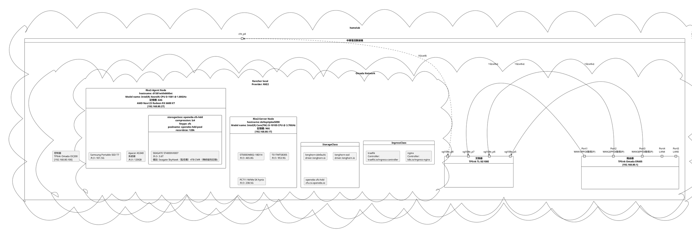

# Fleet RKE2 Homelab GitOps

此專案用於管理部署在 **RKE2 Homelab** 叢集上的基礎服務與應用程式。透過與 **Rancher Fleet (fleet-local)** 進行 GitOps 整合，實現宣告式（Declarative）與自動化的持續部署。

---

## 🚀 專案用途與 GitOps 機制

此專案採用 **GitOps** 的核心理念，所有叢集狀態皆定義於 Git 儲存庫中。

* **部署引擎**：[Rancher Fleet](https://fleet.rancher.io/)
* **目標命名空間 (Namespace)**：`fleet-local` (代表 Rancher 管理的本地/主要叢集)
* **部署資源**：包含核心 Kubernetes 基礎設施 (Infrastructure) 以及單一整合登入 (SSO) 平台應用

---

## 🛠️ 基礎服務與應用範圍

本專案管轄的服務分為兩大類：

### 1. 🎛️ 關鍵基礎設施服務 (Infrastructure)

此類服務提供叢集的核心功能（儲存、證書、資料庫等），是其他應用程式運行的基石：

* **[cert-manager](infrastructure/cert-manager/)**：自動化管理 SSL/TLS 憑證與發行。
* **[openebs](infrastructure/openebs/)**：提供本地磁碟的動態儲存卷 (StorageClass) 供應。
* **[cnpg (CloudNativePG)](infrastructure/cnpg/)**：管理叢集內高可用的 PostgreSQL 資料庫。
* **[keda](infrastructure/keda/)**：Kubernetes 事件驅動自動擴充 (Event-driven Autoscaling) 控制器。

### 2. 🔑 單一整合登入平台與應用 (SSO & Applications)

此類服務以 **Authentik** 為核心，提供單一登入（SSO）的整合入口與開發工具：

* **[authentik](apps/authentik/)**：SSO 登入驗證中心，負責使用者權限與身份驗證。
* **[sonarqube](apps/sonarqube/)**：程式碼品質與安全性掃描平台。
* **[coder](apps/coder/)**：基於 Kubernetes 的遠端雲端開發環境平台。
* **[guacamole](apps/guacamole/)**：無用戶端的遠端桌面網關 (RDP/SSH/VNC)。
* **[open-webui](apps/open-webui/)**：用於互動的 AI Web 介面。
* **[comfyui](apps/comfyui/)**：基於 Node 流程圖的 Stable Diffusion / 影片生成與編輯 UI (AMD ROCm 硬體加速)。
* **[plantuml](apps/plantuml/)**：PlantUML 繪圖與渲染服務。
* **[ollama](base/ollama/)**：本地大語言模型 (LLM) 運行引擎。

---

## 📁 目錄結構說明

專案目錄結構遵循 Fleet Bundle 的組織規範：

```text
fleet-rke2-homelab/
├── README.md                             # 本說明文件
├── infrastructure/                       # 核心基礎設施 Bundles
│   ├── cnpg/
│   │   └── fleet.yaml                    # CloudNativePG 部署設定
│   ├── cert-manager/
│   │   └── fleet.yaml                    # cert-manager 部署設定
│   ├── openebs/
│   │   └── fleet.yaml                    # OpenEBS 部署設定
│   └── keda/
│       └── fleet.yaml                    # KEDA 部署設定
├── base/                                 # 基礎組件 (可供 kustomize 或參考)
│   ├── ollama/
│   │   └── fleet.yaml                    # Ollama 引擎設定
│   └── open-webui/
│       └── fleet.yaml                    # Open WebUI (Base 版本)
└── apps/                                 # 終端應用程式與 SSO 整合服務 Bundles
    ├── authentik/
    │   └── fleet.yaml                    # Authentik 部署設定
    ├── sonarqube/
    │   └── fleet.yaml                    # SonarQube 部署設定
    ├── coder/
    │   └── fleet.yaml                    # Coder 部署設定
    ├── guacamole/
    │   └── fleet.yaml                    # Apache Guacamole 部署設定
    ├── open-webui/
    │   └── fleet.yaml                    # Open WebUI (Apps 整合版本)
    ├── comfyui/
    │   └── fleet.yaml                    # ComfyUI (AMD ROCm 影片生成編輯)
    └── plantuml/
        └── fleet.yaml                    # PlantUML Server 部署設定
```

---

## 🖥️ RKE2 群集部屬架構總覽圖



---

## 🌐 叢集全域變數 (Cluster templateValues)

在 Rancher 平台的 `Cluster` 資源 (`fleet-local` 命名空間下的 `local` 叢集) 之 `spec.templateValues` 中可定義叢集共享變數。本專案中的所有 Fleet Bundle (`fleet.yaml`) 可透過 `${ .ClusterValues.<key> }` 動態引用：

### Rancher Cluster 設定範例 (`spec.templateValues`)

可在 Rancher UI 或經由 `kubectl edit cluster -n fleet-local local` 設定：

```yaml
spec:
  templateValues:
    certManager:
      clusterIssuer: letsencrypt-cloudflare
    domain:
      base: mlc.app
    ingress:
      class: nginx
      targets:
        nginx: p1-ziyi-bear.duckdns.org
        traefik: p2-ziyi-bear.duckdns.org
    storage:
      hddClass: openebs-zfs-hdd
      ssdClass: longhorn-ssd
```

### 專案可用的共享變數列表

| 變數路徑 (Key Path) | 設定範例值 | Fleet 引用語法 | 說明 |
| :--- | :--- | :--- | :--- |
| `certManager.clusterIssuer` | `letsencrypt-cloudflare` | `${ .ClusterValues.certManager.clusterIssuer }` | Cert-Manager 發證機構名稱 |
| `domain.base` | `mlc.app` | `${ .ClusterValues.domain.base }` | 叢集基礎網域名稱 |
| `ingress.class` | `nginx` | `${ .ClusterValues.ingress.class }` | 預設 Ingress Controller 類別 |
| `ingress.targets.nginx` | `p1-ziyi-bear.duckdns.org` | `${ .ClusterValues.ingress.targets.nginx }` | `nginx` Ingress Class 之公網/目標 Host |
| `ingress.targets.traefik` | `p2-ziyi-bear.duckdns.org` | `${ .ClusterValues.ingress.targets.traefik }` | `traefik` Ingress Class 之公網/目標 Host |
| `storage.hddClass` | `openebs-zfs-hdd` | `${ .ClusterValues.storage.hddClass }` | 高容量/慢速 HDD 儲存類別 |
| `storage.ssdClass` | `longhorn-ssd` | `${ .ClusterValues.storage.ssdClass }` | 高速 SSD 儲存類別 |

### `fleet.yaml` 引用範例

```yaml
helm:
  values:
    ingress:
      ingressClassName: "${ .ClusterValues.ingress.class }"
      annotations:
        cert-manager.io/cluster-issuer: "${ .ClusterValues.certManager.clusterIssuer }"
      hosts:
        - host: "app.${ .ClusterValues.domain.base }"
    persistence:
      storageClass: "${ .ClusterValues.storage.ssdClass }"
```

---

## ☸️ 如何在 Rancher Fleet 中部署

要在 `fleet-local` 命名空間中啟用 GitOps 同步，您需要在 Rancher/K8s 管理叢集上套用 `GitRepo` 自訂資源 (Custom Resource)。

### `GitRepo` 範例清單 (Manifest)

建立一個名為 `homelab-infrastructure.yaml` 的檔案並套用：

```yaml
apiVersion: fleet.cattle.io/v1alpha1
kind: GitRepo
metadata:
  name: fleet-rke2-homelab
  namespace: fleet-local
spec:
  # 指向此 Git 儲存庫的網址
  repo: https://github.com/<your-username>/fleet-rke2-homelab.git
  branch: main
  
  # 指定要監聽與部署的目錄路徑
  paths:
    - infrastructure
    - apps
    - base
    
  # 目標叢集選擇器 (對準 rke2-homelab 叢集)
  targets:
    - clusterName: rke2-homelab
```

套用指令：

```bash
kubectl apply -f homelab-infrastructure.yaml
```

---

## 📝 應用程式新增與修改指南

1. **新增應用程式**：
   在 `apps/` 或 `infrastructure/` 下建立對應的目錄，並在其中編寫 `fleet.yaml` 檔。
2. **客製化 Helm Values**：
   可以直接在 `fleet.yaml` 的 `helm.values` 區段下進行設定，或是提供 `values.yaml` 並在 `fleet.yaml` 中引用。
3. **敏感資訊管理**：
   > [!WARNING]
   > 請勿將任何明文金鑰、密碼 (Secrets) 直接提交至 Git。建議使用 **ExternalSecrets**、**HashiCorp Vault** 或透過 Rancher Console 在目標 Namespace 中預先手動建立 Secret，並在 `fleet.yaml` 中引用。
